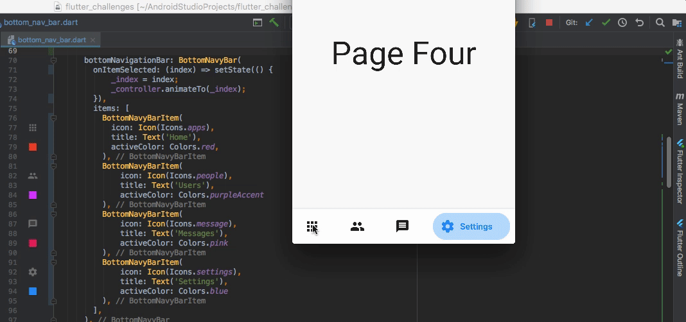

# BottomNavyBar

A beautiful and animated bottom navigation. The navigation bar use your current theme, but you are free to customize it.

## Fix
Support setState to change BottomNavyBar's _selectindex,just copy bottom_navy_bar.dart into your project

## Preview


## PageView


## Getting Started

Add the plugin:

```yaml
dependencies:
  ...
  bottom_navy_bar: ^5.2.0
```

## Basic Usage

Adding the widget

```dart
bottomNavigationBar: BottomNavyBar(
   selectedIndex: _selectedIndex,
   showElevation: true, // use this to remove appBar's elevation
   onItemSelected: (index) => setState(() {
              _selectedIndex = index;
              _pageController.animateToPage(index,
                  duration: Duration(milliseconds: 300), curve: Curves.ease);
    }),
   items: [
     BottomNavyBarItem(
       icon: Icon(Icons.apps),
       title: Text('Home'),
       activeColor: Colors.red,
     ),
     BottomNavyBarItem(
         icon: Icon(Icons.people),
         title: Text('Users'),
         activeColor: Colors.purpleAccent
     ),
     BottomNavyBarItem(
         icon: Icon(Icons.message),
         title: Text('Messages'),
         activeColor: Colors.pink
     ),
     BottomNavyBarItem(
         icon: Icon(Icons.settings),
         title: Text('Settings'),
         activeColor: Colors.blue
     ),
   ],
)
```

## Customization (Optional)

### BottomNavyBar
**iconSize** - the item icon's size<br/>
**items** - navigation items, required more than one item and less than six<br/>
**selectedIndex** - the current item index. Use this to change the selected item. Default to zero<br/>
**onItemSelected** - required to listen when a item is tapped it provide the selected item's index<br/>
**backgroundColor** - the navigation bar's background color<br/>
**showElevation** - if false the appBar's elevation will be removed<br/>
**itemCornerRadius** - use this property to change the active item's corner radius<br/>

### BottomNavyBarItem
**icon** - the icon of this item<br/>
**title** - the text that will appear next to the icon when this item is selected<br/>
**activeColor** - the active item's background and text color<br/>
**inactiveColor** - the inactive item's icon color<br/>
